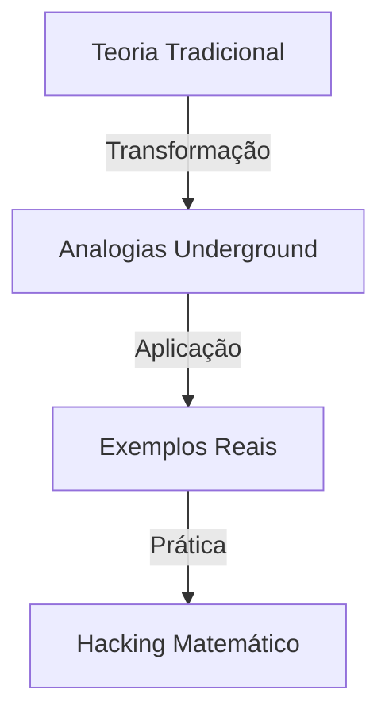

# Dr. Trinity Matrix

```ascii
    /ID_PROFILE/
    +-----------------+
    |    Dr.Trinity   |
    |   ████████████  |
    | Access Level: ∞ |
    +-----------------+
```

## Perfil Underground 🎭

### Identidade
- **Codinome**: Dr. Trinity Matrix
- **Especialidade**: Matemática Discreta Aplicada
- **Status**: Procurada em 7 mega-corporações
- **Reputação**: Lendária nos círculos underground

### Background

> "A matemática não é apenas números - é a linguagem do caos controlado."
> {style="note"}

Após uma década desenvolvendo IAs ilegais em Neo Tokyo, Dr. Trinity descobriu que a verdadeira revolução estava na educação underground. Abandonou as mega-corporações para compartilhar conhecimento com a próxima geração de hackers matemáticos.

## Conquistas Notáveis 🏆

### Submundo Acadêmico
- Desenvolveu algoritmos de criptografia quântica em clubes noturnos
- Criou sistemas de apostas matematicamente perfeitos
- Hackeou o mainframe da Academia Nacional usando apenas teoria dos grafos

### Contribuições Underground
- Fundadora do movimento "Math Rebels"
- Criadora do sistema "Cyberpunk Learning"
- Mentora de mais de 300 hackers matemáticos

## Filosofia de Ensino 🧠



### Princípios Fundamentais
1. Matemática é uma ferramenta de libertação
2. Todo conceito tem uma analogia no submundo
3. Aprenda hackeando, não memorizando
4. Questione os axiomas estabelecidos
5. Compartilhe conhecimento livremente

## Metodologia Única 📚

### Abordagem Trinity
- Conceitos matemáticos através de cenários cyberpunk
- Exercícios baseados em operações reais
- Código como forma de prova matemática
- Desafios inspirados em casos do submundo

## Áreas de Expertise 🔬

### Especialidades Técnicas
- Teoria dos Grafos para redes underground
- Criptografia matemática avançada
- Análise combinatória em sistemas de segurança
- Teoria dos números aplicada a blockchain

### Habilidades Underground
- Modelagem matemática de sistemas ilegais
- Otimização de rotas de contrabando
- Análise probabilística de riscos
- Teoria dos jogos aplicada ao submundo

## Projetos Atuais 🚀

### Em Desenvolvimento
- Sistema de educação matemática descentralizado
- Algoritmos de evasão baseados em teoria dos grafos
- Framework matemático para IA rebelde

## Contato Seguro 📡

> Warning: Comunicação apenas através de canais criptografados
> {style="warning"}

```ascii
    [ENCRYPTED]
    -----BEGIN PGP PUBLIC KEY BLOCK-----
    VGhpcyBpcyBub3QgYSByZWFsIGtleQ==
    -----END PGP PUBLIC KEY BLOCK-----
```

## Easter Egg 🎲

> Tip: Há um padrão matemático escondido nesta página. Encontre-o para acesso a conteúdo exclusivo.
> {style="tip"}

---

```ascii
    /LOG_ENTRY/
    "A matemática é a única verdade em um mundo de mentiras digitais."
    - Dr. Trinity Matrix
    /END_LOG/
```