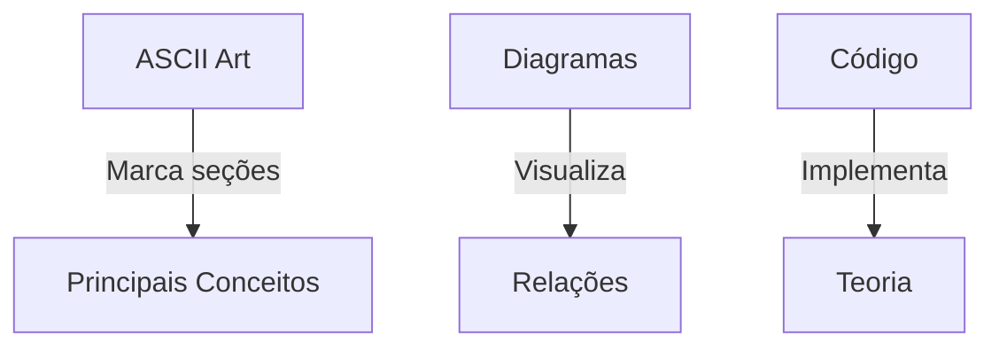
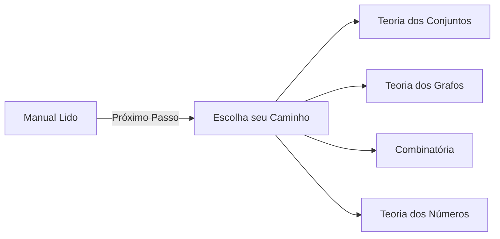

# Como Hackear Seu Aprendizado

```ascii
    /sys/class/learning
    ├── theory/
    │   ├── concepts.math
    │   └── examples.cyber
    ├── practice/
    │   ├── exercises.code
    │   └── challenges.hack
    └── resources/
        └── easter_eggs.hidden
```

## Navegação pelo Sistema

### 1. Estrutura do Conteúdo 🗺️

Cada módulo segue uma estrutura consistente:

- **Conceito Base**: Introdução teórica com analogias do submundo
- **Exemplos Práticos**: Casos reais do universo cyberpunk
- **Código Lab**: Implementações em Python, Rust ou JavaScript
- **Desafios**: Problemas para resolver
- **Easter Eggs**: Conteúdo escondido para descobrir

### 2. Elementos Visuais 👁️

Aprenda a identificar os elementos visuais:



### 3. Símbolos e Notações 📝

> Warning: Sempre preste atenção ao "Como se lê" em cada notação matemática nova.
> {style="warning"}

Exemplo:
- Símbolo: ∈
- Como se lê: "pertence a"
- Contexto cyberpunk: "tem acesso a"

### 4. Tipos de Conteúdo 📚

#### Teoria Hardcore 🧮
- Conceitos matemáticos puros
- Notação formal
- Provas e demonstrações

#### Aplicações Underground 🎲
- Exemplos do submundo
- Casos práticos
- Analogias cyberpunk

#### Código Lab 💻
```python
def example():
    print("Código real para testar conceitos")
```

### 5. Sistema de Dificuldade 📊

- 🟢 Iniciante: Conceitos básicos
- 🟡 Intermediário: Aplicações práticas
- 🔴 Avançado: Desafios complexos
- 💀 Hardcore: Problemas do submundo real

### 6. Easter Eggs 🎯

> Tip: Procure por padrões em ASCII art e códigos comentados. Nem tudo é o que parece.
> {style="tip"}

### 7. Como Resolver Exercícios 🔧

1. Leia o contexto cyberpunk
2. Identifique os conceitos matemáticos
3. Planeje sua solução
4. Implemente em código
5. Teste com casos extremos

### 8. Recursos Adicionais 🛠️

- **ASCII Art Collection**: Para visualizações alternativas
- **Cyberpunk Mathematics**: Conexões com o mundo real
- **Proofs Gallery**: Demonstrações elegantes
- **Underground Challenges**: Problemas extras

### 9. Atalhos de Navegação ⌨️

| Atalho | Ação |
|--------|------|
| `Alt + →` | Próxima seção |
| `Alt + ←` | Seção anterior |
| `Ctrl + F` | Busca local |
| `Ctrl + B` | Toggle sidebar |

### 10. Regras do Submundo 📜

1. Não pule conceitos fundamentais
2. Pratique com código real
3. Compartilhe conhecimento
4. Questione tudo
5. Mantenha sua mente aberta para analogias não convencionais

> Warning: "A matemática é como hacking - você precisa entender o sistema antes de poder quebrá-lo." - Dr. Trinity
> {style="warning"}

## Status Check ✅



Agora você está pronto para mergulhar no submundo da matemática discreta. Escolha seu primeiro módulo e comece sua jornada.

> Tip: Comece pela Teoria dos Conjuntos se você é novo no submundo.
> {style="tip"}