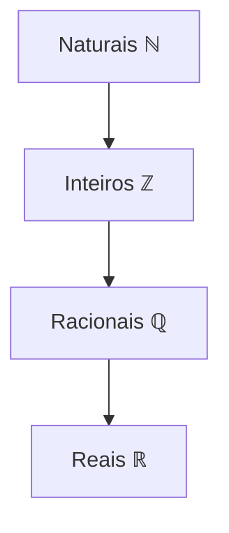
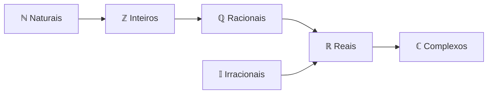

# Conjuntos Numéricos

```ascii
    /\___/\   NÚMEROS
   (  o o  )  CONJUNTOS &
   (  =^=  )  OPERAÇÕES
    (______)°
```

## Visão Geral dos Conjuntos 🎲

Como um cassino clandestino, cada conjunto tem suas próprias regras e membros VIP:

### Números Naturais (ℕ)
- O clube mais básico: `ℕ = {0, 1, 2, 3, 4, ...}`
- VIP list (naturais sem zero): `ℕ* = {1, 2, 3, 4, ...}`

### Números Inteiros (ℤ)
- O clube underground completo: `ℤ = {..., -3, -2, -1, 0, 1, 2, 3, ...}`
- Inclui todos os naturais: `ℕ ⊂ ℤ`

### Números Racionais (ℚ)
- O clube das frações: `ℚ = {x | x = a/b, onde a, b ∈ ℤ e b ≠ 0}`
- Membros especiais:
  - Decimais exatos: `1/4 = 0,25`
  - Decimais periódicos: `-5/9 = -0,555...`



### Números Irracionais (𝕀)
- O clube dos rebeldes: decimais infinitos não-periódicos
- VIP members: `√2, √3, π`

### Números Reais (ℝ)
- O mega clube: `ℝ = ℚ ∪ 𝕀`
- Todos os números da linha real

### Números Complexos (ℂ)
- O clube multidimensional: `c = a + bi, onde a, b ∈ ℝ`
- Operações especiais:
  ```python
  # Soma
  (a + bi) + (c + di) = (a + c) + (b + d)i
  
  # Produto
  (a + bi) * (c + di) = (ac - bd) + (bc + ad)i
  ```

## Hierarquia dos Conjuntos 🎯



## Quick Reference Matrix

| Conjunto | Símbolo | Exemplos | Características |
|----------|---------|----------|-----------------|
| Naturais | ℕ | `{0, 1, 2, ...}` | Contagem, índices |
| Inteiros | ℤ | `{..., -2, -1, 0, 1, ...}` | Positivos e negativos |
| Racionais | ℚ | `{1/2, -3/4, 0.75}` | Frações, decimais finitos/periódicos |
| Irracionais | 𝕀 | `{π, √2, e}` | Decimais infinitos não-periódicos |
| Reais | ℝ | `{π, -2, 1.5}` | Linha numérica completa |
| Complexos | ℂ | `{2+3i, -1+i}` | Plano complexo |

> "No submundo dos números, cada conjunto é um território, e cada operação é uma negociação." - Dr. Trinity
> {style="warning"}

## Exemplos Práticos 🔧

<tabs>
<tab title="Python">


```python
from typing import Set
from math import sqrt, pi

# Exemplos de conjuntos
naturais: Set[int] = {0, 1, 2, 3, 4, 5}
inteiros: Set[int] = {-2, -1, 0, 1, 2}
racionais: Set[float] = {0.5, -0.75, 1.0}
irracionais: Set[float] = {sqrt(2), pi}

# Verificação de pertinência
def is_natural(n: int) -> bool:
    return n >= 0 and isinstance(n, int)

def is_rational(n: float) -> bool:
    from fractions import Fraction
    try:
        Fraction(n).limit_denominator()
        return True
    except:
        return False
```


</tab>

<tab title="JavaScript">


```javascript
class NumberSets {
    static isNatural(n) {
        return Number.isInteger(n) && n >= 0;
    }
    
    static isInteger(n) {
        return Number.isInteger(n);
    }
    
    static isRational(n) {
        if (!isFinite(n)) return false;
        return true; // Simplificado para exemplo
    }
    
    static isComplex(n) {
        return n instanceof Complex;
    }
}

// Exemplo de uso
const number = 42;
console.log(`${number} é natural? ${NumberSets.isNatural(number)}`);
```


</tab>
</tabs>

## Easter Egg 🎲

> Decodifique: Os números complexos são como hackers - operam em múltiplas dimensões simultaneamente.
> {style="tip"}