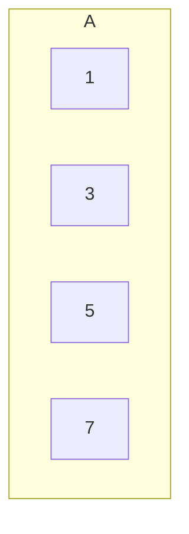
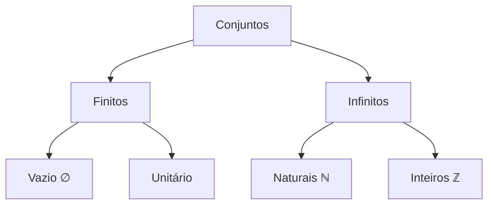

# Noções de Conjuntos

```ascii
         ___________________
     .d$$$$*$$$$$$bc
    d$$$$"  `"$$$$$$b
   d$$$$$$$$$$$$$$$$$$b
  d$$$$$$$$$$$$$$$$$$$$b      CONJUNTOS
 d$$$$$$$$$$$$$$$$$$$$$$b     ════════
.$$$$$$$$$$$$$$$$$$$$$$$$$    INIT_SYS
.$$$$$$$$$$$$$$$$$$$$$$$$$$b  ════════
.$$$$$$$$$$$$$$$$$$$$$$$$$$$
$$$$$$$$$$$$$$$$$$$$$$$$$$$$  {x │ x ∈ U}
$$$$$$$$$$$$$$$$$$$$$$$$$$$$  
$$$$$$$$$$$$$$$$$$$$$$$$$$$'  [ENCRYPTED]
'$$$$$$$$$$$$$$$$$$$$$$$$$$  
 '$$$$$$$$$$$$$$$$$$$$$$$$'
  '$$$$$$$$$$$$$$$$$$$$$'     > STATUS: OK
   `"$$$$$$$$$$$$$$$$$"       > ACCESS: A+
     `"*$$$$$$$$$*"`         
```

## Definição Base

Um conjunto é como uma lista VIP de um clube: uma coleção de elementos distintos onde a ordem não importa. Assim como na lista de convidados, o que importa é quem está dentro, não a ordem de chegada.

### Representações

#### 1. Notação com Chaves
- Forma explícita: $A = \{1, 3, 5, 7\}$
- Com condição: $P = \{x \mid x \text{ é número primo}\}$

#### 2. Diagrama de Venn


## Tipos Especiais de Conjuntos

### Conjunto Vazio ($\emptyset$)
- Como um clube fechado: nenhum elemento dentro
- Notação: $\emptyset$ ou $\{\}$
- Exemplo: $M = \{x \mid x \text{ é mês começando com Z}\} = \emptyset$

### Conjunto Unitário
- Como uma sala VIP exclusiva: apenas um elemento
- Exemplo: $U = \{42\}$

### Conjunto Universo
- Como a lista global de todos os usuários do sistema
- Contém todos os elementos possíveis do contexto

## Cardinalidade

A cardinalidade é como o contador de pessoas no clube:
- Notação: $n(A)$ ou $|A|$
- Exemplo: Se $A = \{1, 3, 5, 7\}$, então $|A| = 4$

## Exemplos Práticos do Submundo

### 1. Lista de Acesso
$A = \{x \mid x \text{ tem credencial de nível A}\}$

### 2. Senhas Válidas
$S = \{x \mid x \text{ tem 8+ caracteres e símbolos especiais}\}$

### 3. IPs Bloqueados
$B = \{x \mid x \text{ falhou autenticação 3+ vezes}\}$

## Exercícios de Hack

1. Descreva os elementos e indique a cardinalidade:

   a) $A = \{x \mid x \text{ é mês do ano}\}$
   - Elementos: {Janeiro, Fevereiro, ..., Dezembro}
   - Cardinalidade: $|A| = 12$

   b) $B = \{x \mid x \text{ é dia da semana}\}$
   - Elementos: {Segunda, Terça, ..., Domingo}
   - Cardinalidade: $|B| = 7$

   c) $C = \{x \mid x \text{ é múltiplo positivo de 6}\}$
   - Elementos: {6, 12, 18, 24, ...}
   - Cardinalidade: $|C| = \infty$

   d) $D = \{x \mid x \text{ é divisor positivo de 12}\}$
   - Elementos: {1, 2, 3, 4, 6, 12}
   - Cardinalidade: $|D| = 6$

> "Em sistemas de segurança, entender conjuntos é crucial. Um erro na definição de um conjunto de permissões pode comprometer todo o sistema." - Dra. Trinity
> {style="warning"}

## Quick Reference

