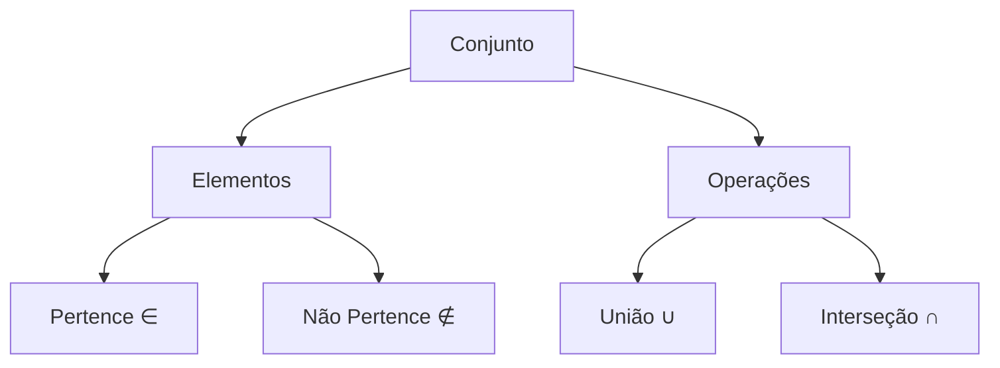

# Teoria dos Conjuntos

```ascii
    +------------------+
    |    CONJUNTO     |
    |    ∈ ∉ ∪ ∩     |
    | ACCESS GRANTED  |
    +------------------+
```

## Introdução ao Submundo dos Conjuntos

No submundo da matemática discreta, conjuntos são como clubes exclusivos em Neo Tokyo - cada um com suas próprias regras de acesso e membros específicos. Vamos explorar este conceito fundamental que é usado em:

- 🎲 Sistemas de controle de acesso em cassinos
- 💻 Grupos de permissões em redes de hackers
- 🎮 Conjuntos de estados válidos em máquinas de arcade
- 🔐 Conjuntos de chaves possíveis em criptografia
- 📊 Análise de dados em apostas clandestinas

## Notação Básica

### No Mundo Real
- Lista VIP de um clube: $A = \{x_1, x_2, x_3, ..., x_n\}$
- Conjunto de senhas válidas: $P = \{p \in ASCII \mid length(p) \geq 8\}$
- Conjunto de IPs bloqueados: $B = \{ip \mid \text{tentativas}(ip) > 3\}$

### Símbolos Essenciais
| Símbolo | Significado | Exemplo no Submundo |
|---------|-------------|---------------------|
| $\in$ | pertence | Usuário tem acesso ao sistema |
| $\notin$ | não pertence | Usuário bloqueado |
| $\emptyset$ | conjunto vazio | Nenhum acesso permitido |
| $\mathbb{N}$ | números naturais | Contagem de tentativas |
| $\mathbb{Z}$ | números inteiros | Saldo em créditos |

## Casos de Uso Práticos

### 1. Controle de Acesso
```python
usuarios_permitidos = {
    "trinity", "neo", "morpheus"
}
def verificar_acesso(usuario):
    return usuario in usuarios_permitidos
```

### 2. Análise de Dados
Se $A$ é o conjunto de transações suspeitas:
$A = \{x \in Transacoes \mid valor(x) > 10000\}$

### 3. Criptografia
Conjunto de caracteres válidos:
$V = \{x \in ASCII \mid 33 \leq ord(x) \leq 126\}$

## Próximos Passos

Para se aprofundar, você precisará entender:
- Operações com conjuntos (união, interseção)
- Relações entre conjuntos
- Propriedades especiais

> "No submundo digital, entender conjuntos é como ter a chave mestra para todos os sistemas." - Dra. Trinity
> {style="note"}

## Quick Reference



## Exercício Prático

Dado o sistema de um cassino clandestino:
- Seja $J$ o conjunto de jogadores
- Seja $B$ o conjunto de jogadores banidos
- Seja $V$ o conjunto de VIPs

Determine:
1. Jogadores que podem entrar: $J - B$
2. VIPs não banidos: $V - B$
3. Total de pessoas no sistema: $|J \cup V|$

> Tip: "Sempre verifique a interseção entre conjuntos de acesso e bloqueio. Um erro pode comprometer todo o sistema." 
> {style="warning"}