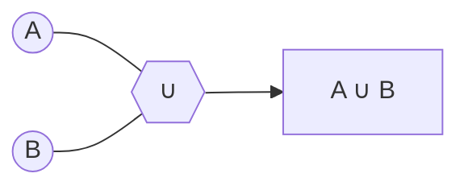

# Operações Entre Conjuntos

```ascii
     ╔══════════════════════════════════╗
     ║     OPERAÇÕES DE CONJUNTOS       ║
     ║  ┌────────────────────────────┐  ║
     ║  │    ∪  ∩  −  ×  ∆  ∁       │  ║
     ║  └────────────────────────────┘  ║
     ║    [SYSTEM_OPERATIONS: ACTIVE]   ║
     ║     [ENCRYPTION: ENABLED]        ║
     ╚══════════════════════════════════╝
```

## União (∪): Fusão de Dados

### Conceito Base {id="conceito-base_1"}
Como merge de databases:
- `A ∪ B`: todos os elementos de A e B combinados
- Sem duplicatas (como um `SET` em programação)



### Exemplo de União
```python
A = {0, 2, 4, 6, 8}
B = {1, 2, 3, 4}
A ∪ B = {0, 1, 2, 3, 4, 6, 8}  # Merge completo
```

### Propriedades da União
```python
# Propriedades como em sistemas distribuídos
A ∪ A = A           # Idempotência
A ∪ ∅ = A          # Elemento neutro
A ∪ B = B ∪ A      # Comutatividade
(A ∪ B) ∪ C = A ∪ (B ∪ C)  # Associatividade
```

## Interseção (∩): Dados Compartilhados

### Conceito Base {id="conceito-base_2"}
Como permissões compartilhadas:
- `A ∩ B`: elementos presentes em ambos os conjuntos
- Similar a um `JOIN` em SQL


### Exemplo de Interseção
```python
A = {0, 2, 4, 6, 8}
B = {1, 2, 3, 4}
A ∩ B = {2, 4}  # Elementos comuns
```

## Diferença (-): Dados Exclusivos

### Conceito Base {id="conceito-base_3"}
Como filtro de acesso:
- `A - B`: elementos de A que não estão em B
- Similar a um `EXCEPT` em SQL

### Exemplo de Diferença
```python
A = {-3, -2, -1, 0, 1, 2}
B = {0, 1, 2, 3, 4, 5}
A - B = {-3, -2, -1}  # Exclusivos de A
```

## Diferença Simétrica (∆): Dados Únicos

### Conceito Base
Como XOR em bits:
- `A ∆ B`: elementos que estão em A ou B, mas não em ambos
- `A ∆ B = (A - B) ∪ (B - A)`

### Exemplo
```python
A = {1, 2, 3, 4, 5, 6}
B = {2, 3, 5, 7, 11, 13}
A ∆ B = {1, 4, 6, 7, 11, 13}  # Elementos únicos
```

## Produto Cartesiano (×): Combinações Completas

### Conceito Base {id="conceito-base_4"}
Como matriz de possibilidades:
- `A × B`: todas as combinações possíveis de pares
- Similar a nested loops em programação

### Exemplo {id="exemplo_1"}
```python
A = {0, 1}
B = {2, 3}
A × B = {(0,2), (0,3), (1,2), (1,3)}  # Todas combinações
```

## Exercícios de Hacking

1. Dados os conjuntos:
   ```python
   A = {1, 2, 3, 4}
   B = {2, 3, 6, 7, 8}
   C = {3, 4, 5, 6}
   ```
   Determine:
   - `A ∪ B`
   - `A ∩ C`
   - `A ∪ (B ∪ C)`
   - `A - (B ∪ C)`
   - `A ∆ B`
   - `A × B`

2. Para `A = {2, 3, 5}` e `B = {1, 2, 3, 4, 5, 6}`, calcule:
   - `n(A ∪ B)`
   - `n(A × B)`

[continua com os outros exercícios...]

> "Em criptografia, as operações entre conjuntos são fundamentais. A diferença simétrica (∆) é como um XOR em bits - vital para encryption." - Dra. Trinity
> {style="warning"}

## Casos Práticos do Submundo 🎲

### Cenário 1: O Clube Noturno
Considere os conjuntos:
```python
VIP = {"Alice", "Bob", "Charlie"}
HACKERS = {"Bob", "Diana", "Eve"}
STAFF = {"Alice", "Eve", "Mallory"}
```

Operações úteis:
- Lista completa de acesso: `VIP ∪ HACKERS ∪ STAFF`
- Hackers com acesso VIP: `VIP ∩ HACKERS`
- Staff não-VIP: `STAFF - VIP`
- Pessoas com duplo papel: `(VIP ∩ STAFF) ∪ (STAFF ∩ HACKERS) ∪ (VIP ∩ HACKERS)`

### Cenário 2: Redes de Dados
```python
REDE_A = {80, 443, 22, 21}  # Portas abertas
REDE_B = {443, 8080, 3306}  # Portas vulneráveis
```

Análise de segurança:
- Portas críticas: `REDE_A ∩ REDE_B`
- Superfície total de ataque: `REDE_A ∪ REDE_B`
- Portas exclusivas: `REDE_A ∆ REDE_B`

## Implementações em Código 💻

### Operações Básicas de Conjuntos

<tabs>
<tab title="Python">


```python
class SetOperations:
    @staticmethod
    def union(set_a: set, set_b: set) -> set:
        return set_a | set_b
    
    @staticmethod
    def intersection(set_a: set, set_b: set) -> set:
        return set_a & set_b
    
    @staticmethod
    def difference(set_a: set, set_b: set) -> set:
        return set_a - set_b
    
    @staticmethod
    def symmetric_difference(set_a: set, set_b: set) -> set:
        return set_a ^ set_b

# Exemplo de uso
hackers = {"trinity", "neo", "morpheus"}
agents = {"smith", "jones", "brown"}
rebels = SetOperations.union(hackers, agents)
```

</tab>

<tab title="JavaScript">


```javascript
class SetHacker {
    static union(setA, setB) {
        return new Set([...setA, ...setB]);
    }
    
    static intersection(setA, setB) {
        return new Set([...setA].filter(x => setB.has(x)));
    }
    
    static difference(setA, setB) {
        return new Set([...setA].filter(x => !setB.has(x)));
    }
    
    static symmetricDifference(setA, setB) {
        const union = this.union(setA, setB);
        const intersection = this.intersection(setA, setB);
        return new Set([...union].filter(x => !intersection.has(x)));
    }
}

// Exemplo de uso
const accessCodes = new Set(['alpha', 'beta', 'gamma']);
const validCodes = new Set(['beta', 'delta', 'epsilon']);
const uniqueCodes = SetHacker.symmetricDifference(accessCodes, validCodes);
```


</tab>

<tab title="C++">


```cpp
#include <set>
#include <algorithm>

class SetInfiltrator {
public:
    template<typename T>
    static std::set<T> union_sets(const std::set<T>& set_a, const std::set<T>& set_b) {
        std::set<T> result;
        std::set_union(
            set_a.begin(), set_a.end(),
            set_b.begin(), set_b.end(),
            std::inserter(result, result.begin())
        );
        return result;
    }
    
    template<typename T>
    static std::set<T> intersection(const std::set<T>& set_a, const std::set<T>& set_b) {
        std::set<T> result;
        std::set_intersection(
            set_a.begin(), set_a.end(),
            set_b.begin(), set_b.end(),
            std::inserter(result, result.begin())
        );
        return result;
    }
};

// Exemplo de uso
std::set<int> ports_open = {80, 443, 22};
std::set<int> ports_vulnerable = {443, 8080};
auto critical_ports = SetInfiltrator::intersection(ports_open, ports_vulnerable);
```

</tab>
</tabs>

### Exemplos Práticos

<tabs>
<tab title="Python">


```python
# Análise de Redes
network_a = {80, 443, 22, 21}
network_b = {443, 8080, 3306}

# Encontrar portas vulneráveis comuns
vulnerable_ports = network_a & network_b
print(f"Portas críticas: {vulnerable_ports}")

# Superfície total de ataque
attack_surface = network_a | network_b
print(f"Todas as portas expostas: {attack_surface}")
```


</tab>

<tab title="JavaScript">


```javascript
// Sistema de Acesso
const vipAccess = new Set(['neo', 'trinity', 'morpheus']);
const hackerAccess = new Set(['trinity', 'tank', 'dozer']);

// Encontrar usuários com múltiplos acessos
const multiAccess = new Set(
    [...vipAccess].filter(user => hackerAccess.has(user))
);
console.log('Usuários com acesso duplo:', multiAccess);

// Listar todos os usuários únicos
const allUsers = new Set([...vipAccess, ...hackerAccess]);
console.log('Total de usuários:', allUsers);
```


</tab>

<tab title="C++">


```cpp
// Sistema de Permissões
std::set<std::string> read_access = {"user1", "user2", "admin"};
std::set<std::string> write_access = {"admin", "user2"};

// Encontrar usuários com permissão total
std::set<std::string> full_access;
std::set_intersection(
    read_access.begin(), read_access.end(),
    write_access.begin(), write_access.end(),
    std::inserter(full_access, full_access.begin())
);

// Usuários somente-leitura
std::set<std::string> read_only;
std::set_difference(
    read_access.begin(), read_access.end(),
    write_access.begin(), write_access.end(),
    std::inserter(read_only, read_only.begin())
);
```


</tab>
</tabs>

## Desafios do Submundo 🔥

### Nível 1: Iniciante
Dado o sistema de acesso:
```python
ADMINS = {"trinity", "morpheus", "neo"}
USERS = {"smith", "neo", "oracle"}
BANNED = {"smith", "jones"}
```

1. Quem tem acesso total ao sistema?
2. Existe algum admin banido?
3. Quais usuários não são admins?

### Nível 2: Intermediário 🟡
Sistema de permissões:
```python
READ = {1, 2, 3, 4, 5}
WRITE = {2, 4, 6}
EXECUTE = {1, 3, 5}
```

1. Encontre usuários com permissão total
2. Liste permissões exclusivas de leitura
3. Identifique conflitos de acesso

### Nível 3: Avançado 🔴
Análise de redes:
```python
NETWORK_A = {22, 80, 443, 3306}
NETWORK_B = {80, 8080, 27017}
NETWORK_C = {443, 5432, 6379}
```

1. Calcule vulnerabilidades compartilhadas
2. Determine portas únicas por rede
3. Mapeie todas as combinações de acesso

## Easter Egg: Padrões Ocultos 🎯

> Tip: Os números das portas nos exemplos formam um padrão. Decodifique-o para acesso VIP.
> {style="tip"}

## Quick Reference Matrix

| Operação | Python | JavaScript | C++ |
|----------|--------|------------|-----|
| União | `set_a \| set_b` | `new Set([...setA, ...setB])` | `set_union()` |
| Interseção | `set_a & set_b` | `new Set([...setA].filter(x => setB.has(x)))` | `set_intersection()` |
| Diferença | `set_a - set_b` | `new Set([...setA].filter(x => !setB.has(x)))` | `set_difference()` |
| Dif. Simétrica | `set_a ^ set_b` | `new Set([...union].filter(x => !intersection.has(x)))` | `set_symmetric_difference()` |

> Warning: "Em operações entre conjuntos, assim como no submundo, o que não está explicitamente permitido está proibido." - Dr. Trinity
> {style="warning"}

```ascii
    /END_OPERATION_LOG/
    "A matemática dos conjuntos é como o submundo:
     tudo se resume a quem está dentro e quem está fora."
     - Dr. Trinity Matrix
```