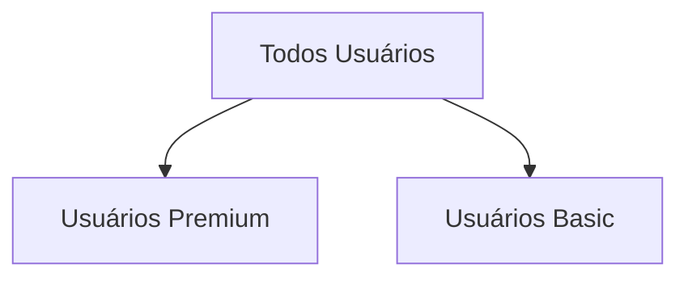
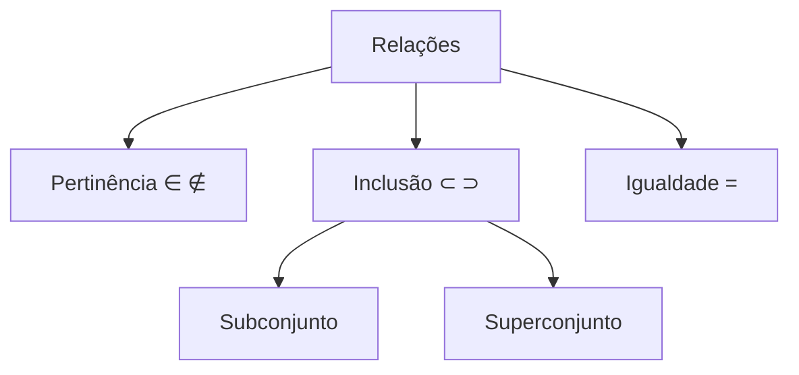

# Relações Entre Conjuntos

```ascii
         ╔═══════════════════════════════╗
         ║    RELAÇÕES DE CONJUNTOS      ║
         ║  ┌─────────────────────────┐  ║
         ║  │    ∈  ∉  ⊂  ⊃  ⊆  ⊇    │  ║
         ║  └─────────────────────────┘  ║
         ║      [ACCESS_LEVEL: A+]       ║
         ║   [SECURITY_CHECK: PASSED]    ║
         ╚═══════════════════════════════╝
```

## Pertinência: O Sistema de Acesso Básico

### Relação de Pertinência
Como um scanner biométrico verificando acesso:
- `∈` (pertence): usuário autorizado
- `∉` (não pertence): acesso negado

#### Exemplo de Acesso
Se `A = {x | x é usuário premium}`, então:
- `vip_user42 ∈ A` (acesso permitido)
- `guest_user ∉ A` (acesso negado)

## Inclusão: Hierarquia de Permissões

### Subconjuntos
Como níveis de acesso em um sistema:
- `A ⊂ B` (A está contido em B): todo usuário de A tem acesso a B
- `B ⊃ A` (B contém A): B engloba todas as permissões de A

#### Exemplo de Hierarquia


Se `A = {0,2,4,6}` e `B = {0,1,2,3,4,5,6,7,8,9,10}`:
- `A ⊂ B`: todos os elementos de A estão em B
- `B ⊃ A`: B contém todos os elementos de A

### Não-Inclusão
Quando há conflito de permissões:
- `A ⊄ B`: existe elemento em A sem acesso a B
- `B ⊅ A`: B não engloba todas as permissões de A

## Conjunto Vazio: O Nível Zero

O conjunto vazio (`∅`) é como o nível de acesso base:
- `∅ ⊂ A`: está contido em qualquer conjunto
- `A ⊃ ∅`: qualquer conjunto contém o vazio

## Conjunto Potência: Todas as Combinações Possíveis

`P(A)`: todas as possíveis combinações de elementos de A
- Cardinalidade: `2ⁿ` (n = número de elementos de A)

### Exemplo de Combinações de Acesso
Para `A = {2, 3, 5, 7}`:
```python
P(A) = {
    ∅,                    # Nenhum acesso
    {2}, {3}, {5}, {7},  # Acesso único
    {2,3}, {2,5}, {2,7}, # Acesso duplo
    {3,5}, {3,7}, {5,7},
    {2,3,5}, {2,3,7},    # Acesso triplo
    {2,5,7}, {3,5,7},
    {2,3,5,7}            # Acesso total
}
```

## Igualdade: Equivalência Total
Dois conjuntos são iguais quando têm exatamente as mesmas permissões:
- `A = B` se `A ⊂ B` e `B ⊂ A`

## Exercícios de Segurança

1. Classifique como Verdadeiro (V) ou Falso (F):
   ```
   ( ) 2 ∈ {0, 1, 2, 3, 4}
   ( ) {4} ∈ {0, 2, 4, 6}
   ( ) {2, 8} ⊄ {0, 2, 4, 6}
   ( ) ∅ ∈ {1, 2, 3}
   ( ) {1, 3, 5} ⊃ ∅
   ( ) {0} ⊂ {0, 1, 2}
   ```

2. Um sistema tem 7 níveis de acesso. Quantas combinações diferentes de múltiplos níveis (2 ou mais) são possíveis?

3. Dado:
   - `A = {5, 7, 9, 11, 13}`
   - `B = {1, 3, 5, 7, 9, 11, 13, 15}`
   
   Qual afirmação é verdadeira?
   ```
   a) ∅ ⊄ A
   b) A ⊂ B
   c) A ⊃ B
   d) B ⊅ A
   e) 15 ∉ B
   ```

> "Em sistemas de segurança, entender relações entre conjuntos é crucial. Um erro na hierarquia de permissões pode ser catastrófico." - Dra. Trinity
> {style="warning"}

## Quick Reference

