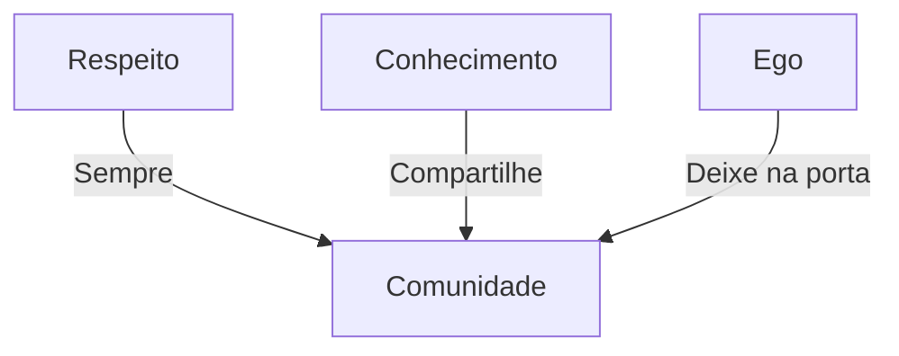

# Regras do Submundo Matemático

```ascii
    /RULES/ACCESS/v1.0
    +------------------+
    |  UNDERGROUND    |
    |     RULES      |
    |   [CLASSIFIED]  |
    +------------------+
```

## Protocolo de Acesso 🔐

### Regra #0: Segurança Operacional
- Mantenha suas soluções em servidores seguros
- Use nomes de código em exemplos
- Nunca revele suas fontes de dados
- Aplique criptografia em seus arquivos

## Regras Fundamentais ⚡

### Regra #1: Código de Conduta


- Respeite outros hackers matemáticos
- Compartilhe conhecimento livremente
- Mantenha seu ego em check
- Ajude iniciantes

### Regra #2: Metodologia de Estudo 📚

> Warning: Pular etapas causará falhas de segurança em seu conhecimento
> {style="warning"}

#### Ordem de Operações:
1. Entenda o conceito base
2. Analise as analogias cyberpunk
3. Estude os exemplos práticos
4. Resolva os desafios
5. Implemente em código
6. Quebre o sistema
7. Reconstrua melhor

### Regra #3: Código é Lei 💻

```python
def validate_solution(answer):
    if not is_elegant(answer):
        raise HackerException("Busque elegância")
    if not is_efficient(answer):
        raise HackerException("Otimize seu código")
    return True
```

- Toda solução deve ser implementável
- Elegância é mandatória
- Eficiência é crucial
- Documentação é respeito

### Regra #4: Ética Hacker 🎯

#### Princípios:
- Use matemática para libertar, não para oprimir
- Conhecimento deve ser livre
- Questione autoridades
- Proteja dados sensíveis
- Ajude os outros a crescer

### Regra #5: Prática Constante 🔄

```ascii
    /training/loop
    ├── learn
    ├── practice
    ├── fail
    ├── analyze
    └── improve
```

- Pratique diariamente
- Aprenda com falhas
- Documente progressos
- Compartilhe descobertas

## Protocolos de Comunicação 📡

### Linguagem Técnica
- Use termos precisos
- Mantenha analogias claras
- Documente exceções
- Explique complexidade

### Canais de Comunicação
| Canal | Uso |
|-------|-----|
| Issues | Problemas técnicos |
| Discussions | Debates teóricos |
| Pull Requests | Contribuições |
| Secure Chat | Mentoria |

## Violações e Penalidades ⚠️

> Warning: Violações podem resultar em banimento do submundo
> {style="warning"}

### Infrações Graves:
- Plágio de soluções
- Trolling em discussões
- Desrespeito à comunidade
- Vazamento de dados sensíveis

## Dicas de Sobrevivência 🎲

### Para Iniciantes:
1. Comece pelos fundamentos
2. Faça todos os exercícios
3. Não tenha medo de errar
4. Peça ajuda quando necessário

### Para Veteranos:
1. Oriente iniciantes
2. Contribua com conteúdo
3. Revise soluções
4. Mantenha-se atualizado

## Easter Egg 🎯

> Tip: Decodifique a mensagem escondida no ASCII art inicial para acesso VIP
> {style="tip"}

---

```ascii
    /END_RULES/
    "No submundo da matemática, 
     as regras existem para serem compreendidas,
     não apenas seguidas."
     - Dr. Trinity Matrix
```