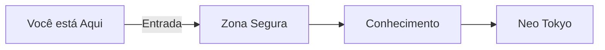

# Bem-vindo ao Submundo da Matemática Discreta

```ascii
     /////////////////\\\\\\\\\\\\\\\\\\
    //                                 \\
   //       MATEMÁTICA DISCRETA        \\
  //                                     \\
 //        ________________________       \\
//        |     |++++++++|     |          \\
||        |     |++++++++|     |          ||
||        |     |++++++++|     |          ||
||        |     |++++++++|     |          ||
||     ___|_____|________|_____|____      ||
||    |                              |     ||
||    |     [ ÁREA RESTRITA ]        |     ||
||    |                              |     ||
||    |   ACESSO SOMENTE COM         |     ||
||    |   AUTORIZAÇÃO DA             |     ||
||    |   DRA. TRINITY MATRIX        |     ||
||    |______________________________|     ||
\\                                        //
 \\     /quantum-math-access-granted\    //
  \\    \level-clearance-authorized/    //
   \\                                  //
    \\\\\\\\\\\\\\\\\/////////////////
```

## Aviso de Acesso

Você está prestes a entrar em uma documentação não convencional de matemática discreta. Este não é seu material acadêmico tradicional - é uma viagem pelo submundo da matemática, onde conceitos complexos ganham vida através de analogias com cassinos, clubes noturnos e cenários de hacking.

> Tip: Mantenha sua mente aberta para analogias não convencionais. O submundo tem suas próprias regras.
> {style="note"}

## Sua Guia: Dra. Trinity Matrix

Como sua mentora nesta jornada, vou guiá-lo pelos becos escuros da matemática discreta. Após anos desenvolvendo IAs em clubes underground de Neo Tokyo, aprendi que a matemática está em todo lugar - especialmente nos lugares mais improváveis.

## O que Esperar

- Teoria dos Conjuntos: Aprenda através de analogias com clubes noturnos exclusivos
- Teoria dos Grafos: Explore rotas de fuga e redes de influência
- Combinatória: Calcule probabilidades em jogos de azar
- Teoria dos Números: Mergulhe na criptografia do submundo 🔐
- Funções: Modele lucros em casas de apostas clandestinas

## Como Navegar

1. Códigos de Acesso: Cada seção tem exemplos práticos em Python, Rust e JavaScript
2. Easter Eggs: Procure por mensagens escondidas e arte ASCII
3. Desafios: Teste suas habilidades com problemas do mundo real
4. Laboratório: Implemente conceitos em código real

> Tip: Procure pelos Easter Eggs escondidos em cada seção. Eles podem conter dicas valiosas.
> {style="note"}

## Regras do Submundo

1. Não existem perguntas estúpidas
2. Código é lei
3. Sempre teste seus algoritmos
4. Compartilhe conhecimento
5. Mantenha sua mente aberta para analogias não convencionais

## Começando

Escolha seu primeiro destino:
- [Teoria dos Conjuntos](Sets_Intro.md) - Para iniciantes no submundo
- [Teoria dos Grafos](Graphs_Intro.md) - Para hackers táticos
- [Combinatória](Combinatorics_Intro.md) - Para apostadores estratégicos
- [Teoria dos Números](Number_Theory_Intro.md) - Para criptógrafos iniciantes

## Status do Sistema



> Tip: "A matemática é como hacking - quanto mais você pratica, mais padrões você começa a ver." - Dra. Trinity
> {style="note"}
