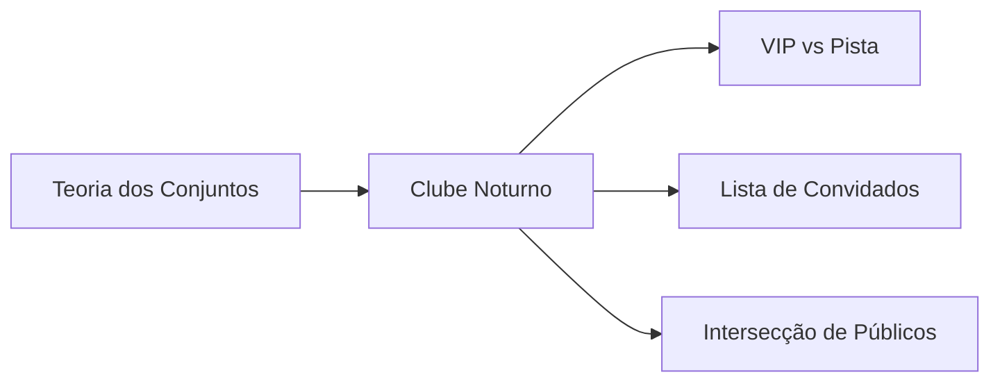

# Learn Math Discret - Briefing

## Regras de Estilo e Formatação

### Títulos e Seções
- NUNCA usar emojis em títulos
- Emojis permitidos apenas em subtextos e descrições
- Títulos devem ser claros e diretos
- Usar title case para títulos principais
- Títulos H1 (heading 1) devem ser sempre simples e diretos, sem pontuação ou caracteres especiais
  - ✅ Correto: "# Conjuntos", "# Grafos", "# Funções"
  - ❌ Incorreto: "# Teoria dos Conjuntos: O Clube Mais Exclusivo", "# Dr. Trinity Matrix: A Matemática do Submundo"

### Estrutura de Documentos
- Começar com uma breve descrição
- Incluir ASCII art relevante após título principal
- Manter hierarquia clara de seções
- Usar exemplos práticos após conceitos

### Estilo de Escrita e Explicações
- Textos devem ser descritivos e detalhados
- Explicações devem ser concisas e diretas ao ponto
- Cada conceito deve ser explicado completamente antes de passar ao próximo
- Usar linguagem clara e precisa
- Evitar redundâncias e informações desnecessárias
- Incluir exemplos práticos para solidificar conceitos
- Manter um fluxo lógico de ideias
- Usar analogias do submundo para clarificar conceitos complexos

## Visão Geral
Uma documentação matemática que quebra o padrão acadêmico tradicional, trazendo conceitos complexos para o mundo real através de analogias não convencionais e exemplos do submundo cyberpunk.

```ascii
    /\___/\
   (  o o  )  Math
   (  =^=  ) 
    (______)° Discret
```

## Persona 🎭
Dr. Trinity Matrix - Uma matemática rebelde que passou anos desenvolvendo IA's ilegais em clubes underground de Neo Tokyo, agora compartilhando conhecimento através de analogias do submundo.

## Abordagem de Conteúdo 🎯

### Estilo de Escrita
- Cyberpunk meets Academia
- Sarcasmo refinado
- Analogias não convencionais (cabarés, jogos, submundo)
- Linguagem técnica misturada com gírias de programador

### Exemplos de Analogias


### Elementos Visuais
- ASCII Art em cada seção principal
- Mindmaps para conexões conceituais
- Diagramas Mermaid para fluxos
- Imagens cyberpunk para ilustrar conceitos

## Tópicos & Abordagem 📚

### Grafos
- Modelagem de redes de influência em cassinos
- Rotas de fuga em cenários de hack
- Otimização de lucros em apostas

### Análise Combinatória
- Probabilidades em jogos de azar
- Combinações de senhas em sistemas de segurança
- Permutações em criptografia underground

### Teoria dos Números
- Criptografia em mensagens do submundo
- Sistemas de apostas modulares
- Divisibilidade em sistemas de pagamento anônimos

### Conjuntos
- Grupos de hackers e suas intersecções
- União de territórios de gangues
- Complementos em sistemas de segurança

### Funções
- Modelagem de lucros em casas de apostas
- Crescimento de organizações paralelas
- Otimização de rotas de contrabando

## Elementos Técnicos 🔧

### Formato
- Markdown com extensões
- Diagramas interativos
- Código em múltiplas linguagens
- Easter eggs em ASCII art

### Exemplos de Código
- Python para probabilidade
- Rust para otimização
- JavaScript para visualizações

## Objetivos de Aprendizado 🎯
1. Domínio matemático sólido
2. Aplicação prática em engenharia/software
3. Pensamento crítico através de analogias reais
4. Memorização através de exemplos controversos

## Métricas de Sucesso 📊
- Engajamento do leitor
- Compreensão dos conceitos
- Aplicabilidade prática
- Diversão durante o aprendizado
